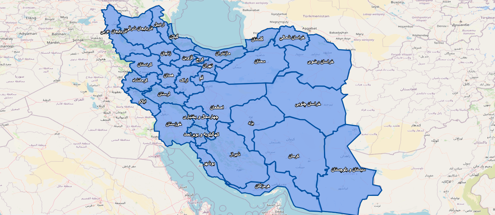

# Iran Province Boundaries Map

This project provides an interactive map of Iran's provinces using GeoJSON format, displayed with **OpenLayers**. It allows users to view and interact with the geographical boundaries of Iran's provinces.

---

## 📌 Features
- **GeoJSON Data:** Includes the boundaries of all 31 provinces of Iran.
- **Interactive Map:** Built with OpenLayers, allowing hover and click interactions.
- **Base Layers:** Provides map layers from OpenStreetMap (OSM) and Bing Maps.
- **Dynamic Styling:** Features different styles for hover and click interactions on the map's features.
- **Zoom Control:** The map has configurable zoom limits (minZoom: 5, maxZoom: 7).

---
## 🖼️ Preview

---

## 🛠️ How to Use

### 1. Clone the Repository
To start using the project locally, clone the repository using the following command:

```bash
git clone https://github.com/alireza-ghayebi/iran-province-boundaries.git
cd iran-province-boundaries
